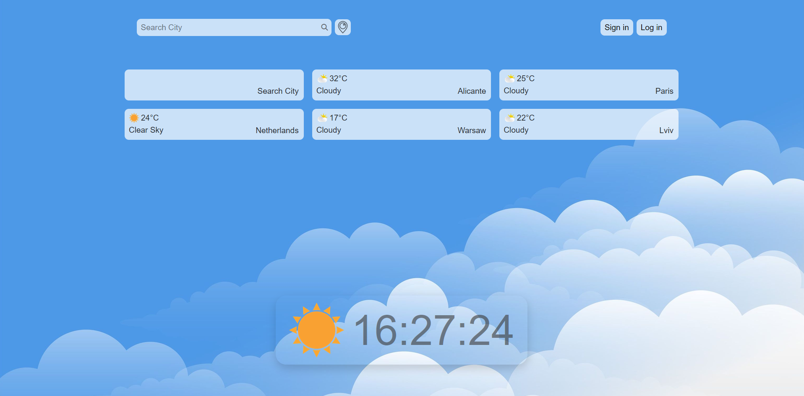

# ☀ Weather App



A responsive weather application that displays current weather data using the Open-Meteo API.

## About the project

This project was developed as a team university assignment.My responsibility was designing and implementing the frontend interface, including the responsive layout, navigation, weather cards, and authentication pages.

After completing the original project, I independently extended the application by integrating the Open-Meteo API. The application now displays current weather data for selected cities and allows users to search for weather conditions in a chosen location.

## Features

- Responsive layout
- Weather dashboard interface
- Login and sign-up pages
- Mobile-friendly navigation
- Responsive weather cards
- Responsive clock component
- Modern user interface
- Current weather data from the Open-Meteo API
- City weather search
- Five predefined weather cards
- Dynamic temperature, weather description, and icon updates
- Loading and error messages

## Technologies

- HTML5
- SCSS
- JavaScript
- Bootstrap 5
- OpenMeteoAPI
- Fetch API

## Project structure

```text 
images/         # Images and icons 
js/             # JavaScript files 
style/          # SCSS and CSS styles 
index.html      # Main page 
log-in.html     # Login page 
sign-in.html    # Registration page 

```  

## Installation

Clone the repository:

```bash 
git clone https://github.com/nxastr/weather-app.git 
```

Open the project folder:

```bash 
cd weather-app
```

Run the application by opening `index.html` in your browser.

## Future improvements

- Add a multi-day weather forecast
- Allow users to customize predefined cities
- Save selected cities in local storage
- Improve accessibility
- Containerize the application with Docker
- Optimize performance
- Add a CI/CD pipeline with GitHub Actions

## Author

**Zuzanna Chmielewska**  